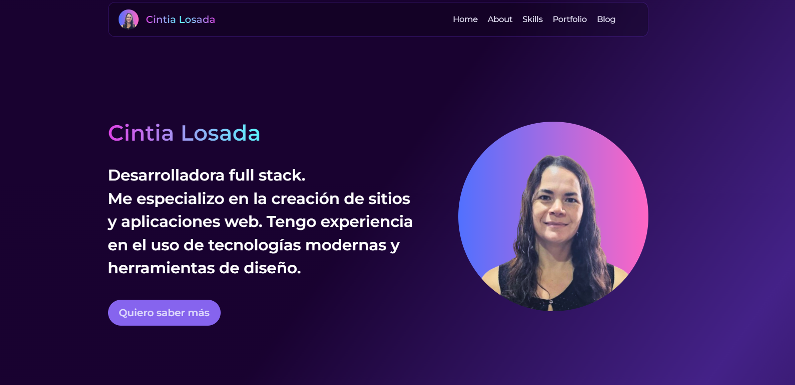

# Portafolio de Cintia Losada

El portafolio está desplegado en [Netlify](https://cintialosada-portfolio.netlify.app/).

## Descripción

Este es el portafolio de Cinlo. Aquí encontrarás información sobre mis proyectos, habilidades y experiencia.

## Tecnologías Utilizadas

Esta plantilla aprovecha varias tecnologías modernas para crear un portafolio altamente responsivo y visualmente atractivo:

- Astro: Un moderno generador de sitios estáticos que te permite usar tus frameworks favoritos como React, Vue y Svelte. Optimiza el rendimiento enviando menos JavaScript.
- React: Una biblioteca de JavaScript para construir interfaces de usuario, que permite la creación de componentes reutilizables.
- Tailwind CSS: Un framework CSS basado en utilidades que te permite diseñar directamente en tu marcado, proporcionando flexibilidad y control sobre tu estilo.
- Styled Components: Una biblioteca para React y React Native que te permite usar estilos a nivel de componente en tu aplicación. Utiliza literales de plantilla etiquetados para estilizar componentes.
- Iconify: Una biblioteca integral para iconos que proporciona acceso a miles de iconos de diferentes colecciones, todos accesibles a través de una única sintaxis.

